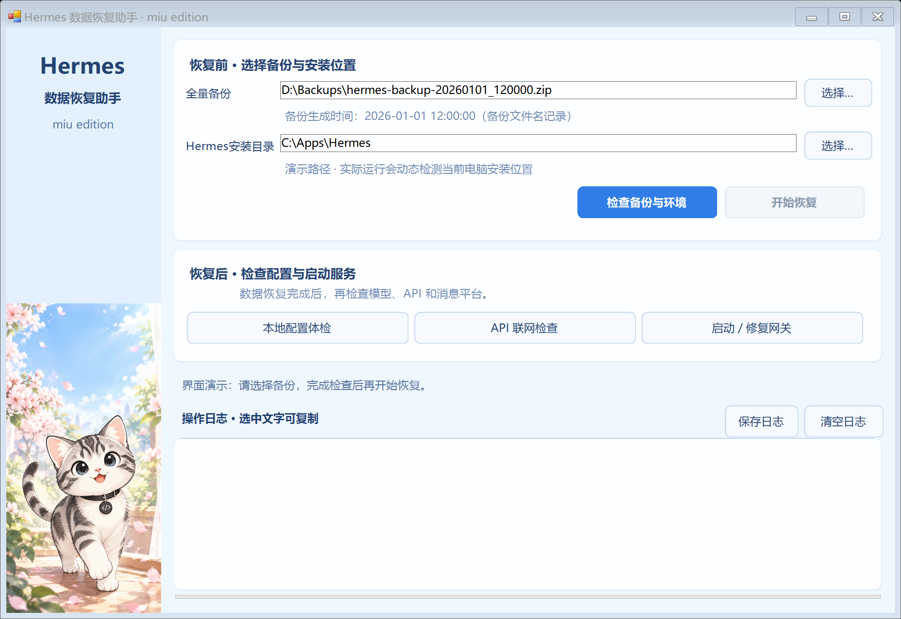

# Hermes Restore · miu edition

面向 Windows 新手的 Hermes 全新安装后数据恢复工具。选择全量备份，点击检查与恢复，无需输入命令。



## 使用

从本仓库 **Releases** 下载 `HermesRestore-miu-edition.zip`，完整解压（保留同目录的 HermesRestore.exe.config）后双击 `HermesRestore.exe`。EXE 未进行数字签名，Windows 可能显示来源提示；可核对发行版附带的 SHA256。

1. 先完成 Hermes 官方安装。
2. 自行选择 Hermes 全量 ZIP 备份。生成时间从支持的备份文件名读取；未知时间会明确标注。
3. 检查自动检测的安装位置和显示的数据恢复位置，必要时选择正确安装目录。
4. 点击“检查备份与环境”，再点击“开始恢复”。恢复会关闭 Hermes 窗口和后台，请先保存未完成的操作。
5. 恢复后运行配置体检，按需检查账户接口、启动网关并实际测试模型对话和平台收发。

## 功能与边界

- CRC、SHA256、路径、容量和关键配置核对。
- 保留新安装的程序文件，通过官方 `hermes import` 恢复用户数据。
- 自动停止网关及可识别的 Hermes 后台；失败时停止并显示日志。
- 本地配置与数据库体检、账户接口联网检查、网关操作。
- 鼠标选中、右键或 Ctrl+C 复制日志，支持保存日志，常见凭据自动脱敏；分享前仍需自行检查日志内容。
- 插画已嵌入 EXE；简约蓝粉主题、9 pt 日志与版本加粗；紧凑布局和逐显示器 DPI 缩放。

此工具面向**全新安装**，没有保护备份、回退或对话合并。导入会覆盖目标数据；备份中不存在的目标额外文件不会删除。原始 ZIP 不被修改，临时导入副本在操作结束后清理；异常退出超过 24 小时的遗留副本在下次启动时清理。

部分 Hermes 版本的导入会短暂自动启动网关，可能触发机器人或定时任务；导入成功后本工具再次停止网关。账户接口正常不能证明模型有调用权限。OAuth、扩展、本地补丁和外部文件仍需另行检查。

支持本机 Windows 10/11 与 .NET Framework 4.8，不支持 WSL/Docker、ZIP64/分卷 ZIP、链接目标或 `_external/` 外部记忆数据。系统安装位置通过当前用户环境和 PATH 动态检测，不包含特定用户路径。备份不会被上传；联网检查只在用户点击并确认后执行。

## 开发与构建

Windows PowerShell 中运行：

```powershell
./build.ps1
./test.ps1
```

使用 Windows 自带 .NET Framework C# 编译器，无需第三方 NuGet 依赖。产物位于 `dist/`。源码是 `src/HermesRestore.cs`；插画为 `assets/cat-sidebar.png`。

GitHub Actions 提供 Windows 构建与核心测试。推送 `v*` 标签会构建并发布发行包及 SHA256。

## 文档与来源

- [恢复操作及限制](docs/usage.md)
- [隐私说明](docs/privacy.md)
- [测试说明](docs/testing.md)
- [Hermes 官方 CLI 文档](https://hermes-agent.nousresearch.com/docs/reference/cli-commands)
- [Hermes 官方安装文档](https://hermes-agent.nousresearch.com/docs/getting-started/installation)

独立社区工具，与 Nous Research / Hermes 官方无关联。代码按 MIT 许可证发布；仓库插画由项目创作者提供的猫咪形象经 AI 制作。
